# My Neovim config

## Requirements

1. Neovim >= v0.7.0
2. Git
3. [Nvim Treesitter requirements](https://github.com/nvim-treesitter/nvim-treesitter#requirements)
3. [Nvim LSP Installer requirements](https://github.com/williamboman/nvim-lsp-installer#installation)

## Installation

1. Clone the repository.

> Powershell

```shell
git clone https://github.com/gmr458/nvim.git "$Env:LOCALAPPDATA\nvim"
```

> CMD

```shell
git clone https://github.com/gmr458/nvim.git %USERPROFILE%\AppData\Local\nvim
```

> Linux

```shell
git clone https://github.com/gmr458/nvim.git ~/.config/nvim
```

2. Open Neovim, plugins and treesitter parsers will be installed automatically.

3. Open the init.lua file, lsp-config will load and the LSP servers will be installed automatically.

This config is highly influenced by [LunarVim/Neovim-from-scratch](https://github.com/LunarVim/Neovim-from-scratch)

<details><summary><b>Click to show preview</b></summary>

### [Catppuccin](https://github.com/catppuccin/nvim)
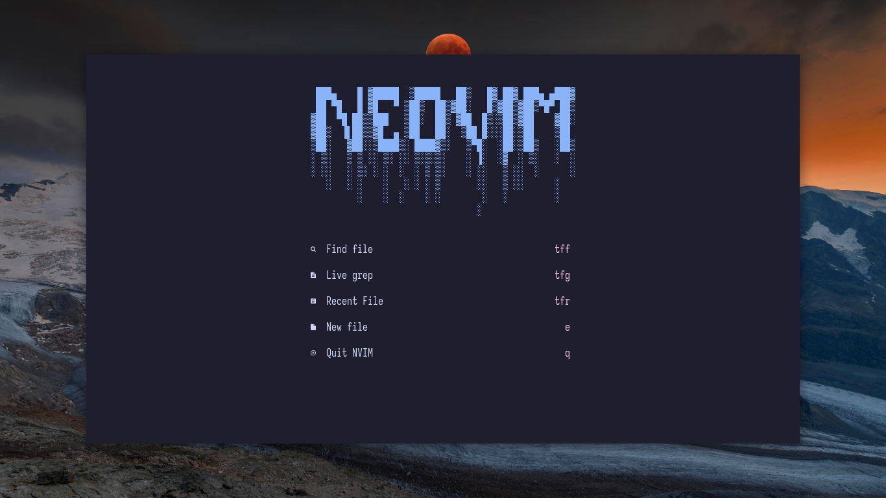
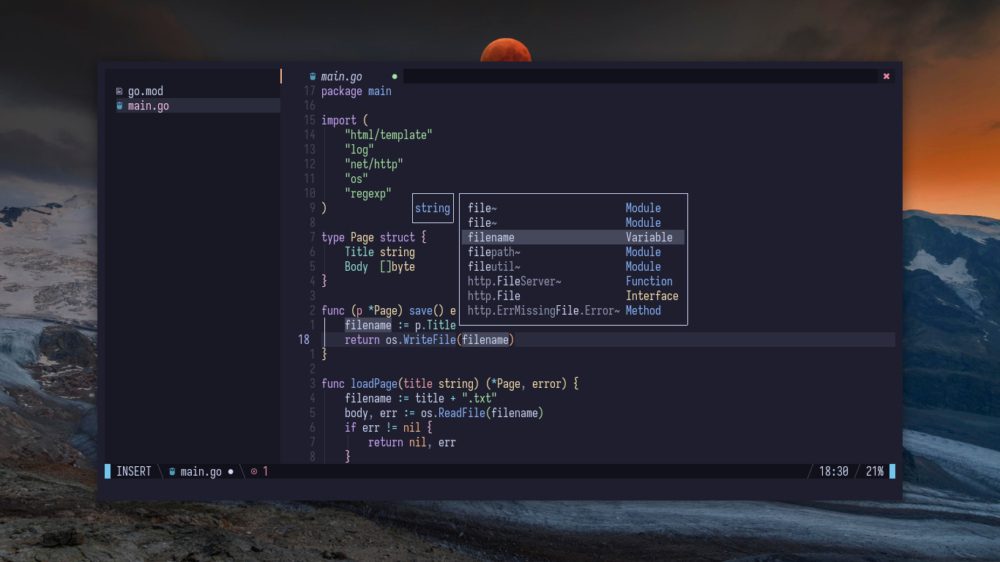

### [Enfocado](https://github.com/wuelnerdotexe/vim-enfocado)
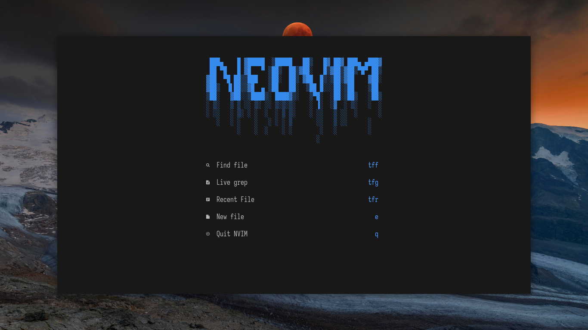
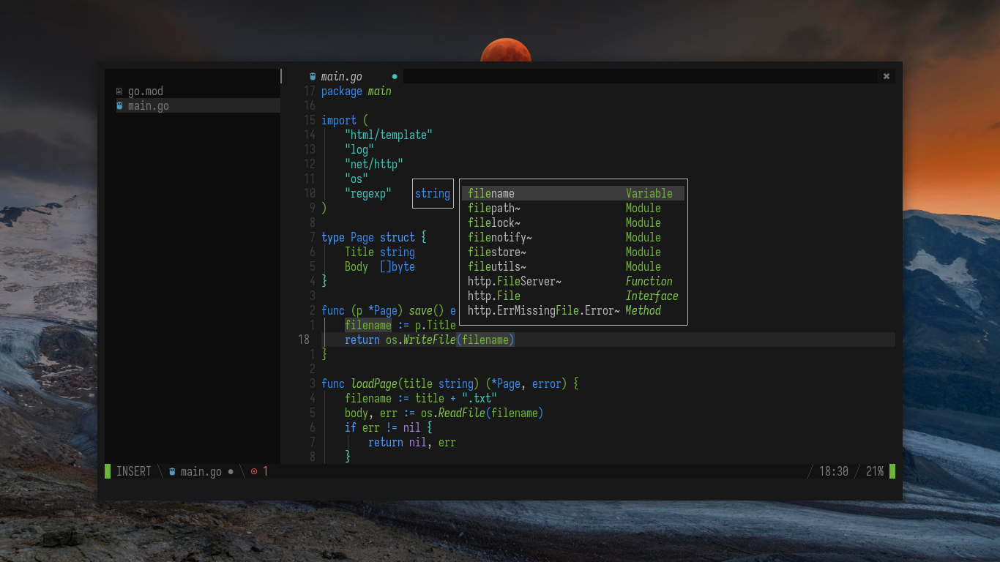

### [GitHub Dark Default](https://github.com/projekt0n/github-nvim-theme)
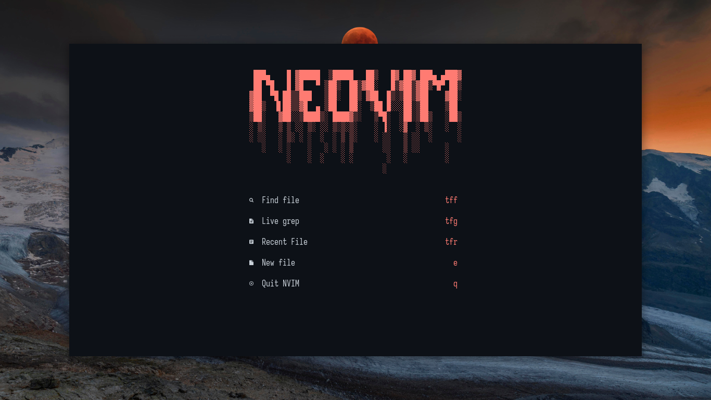
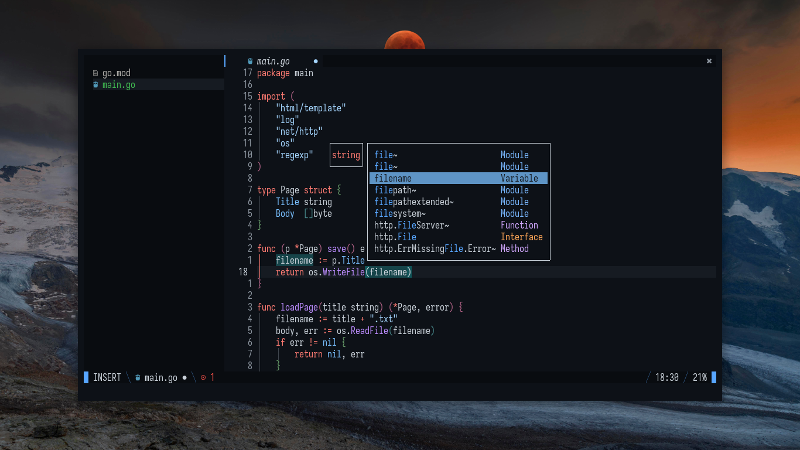

### [Kanagawa](https://github.com/rebelot/kanagawa.nvim)
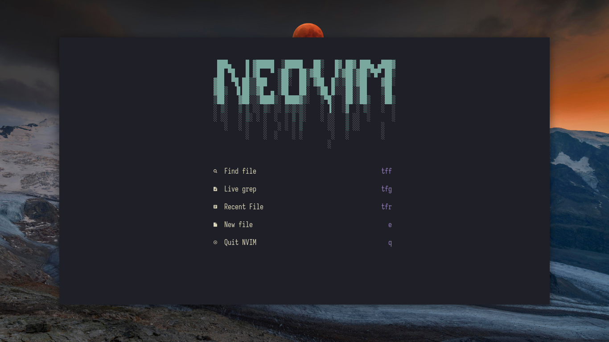
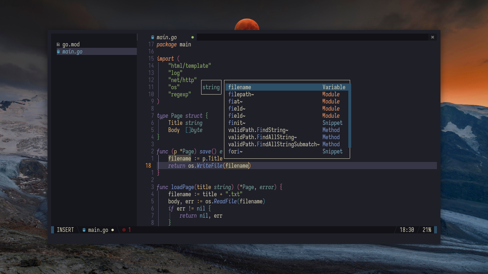

### [Material Ocean Deep](https://github.com/marko-cerovac/material.nvim)
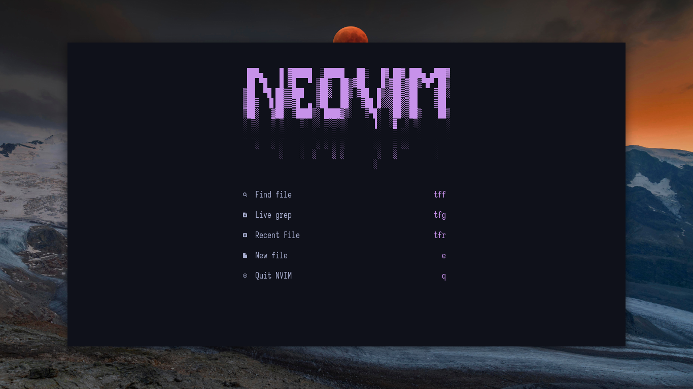
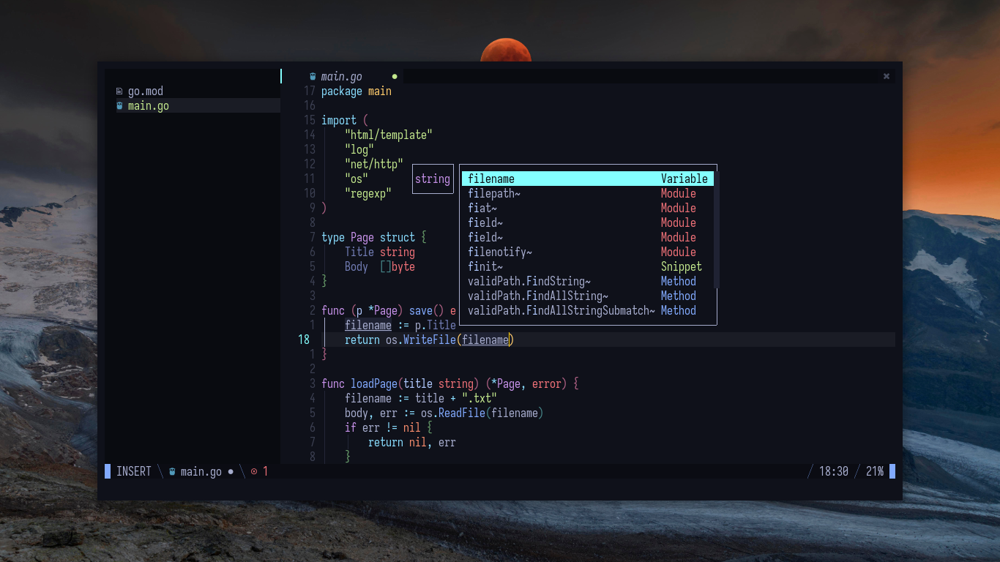

### [OneDark Deep](https://github.com/navarasu/onedark.nvim)
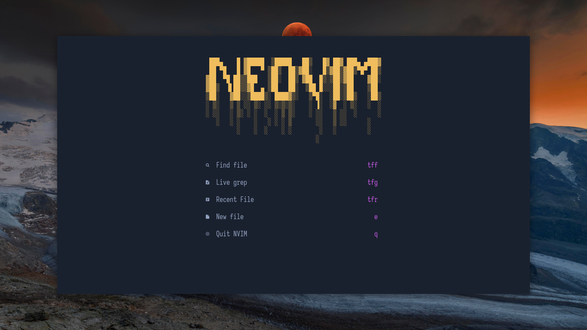
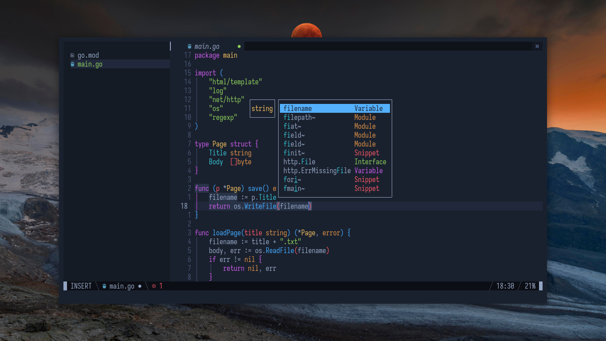

</details>