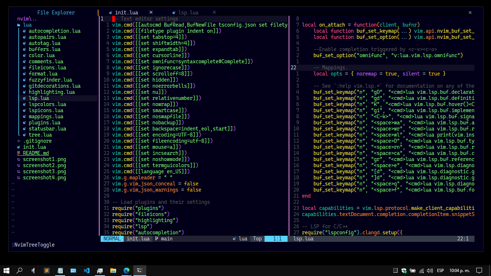
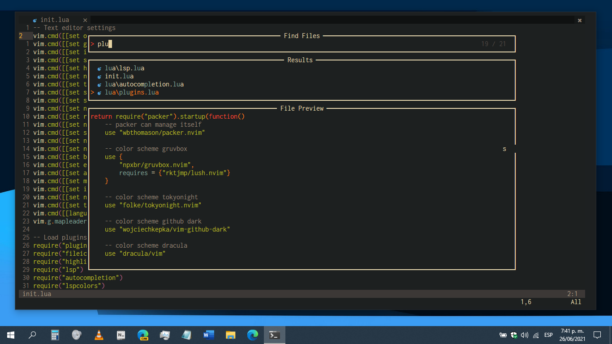
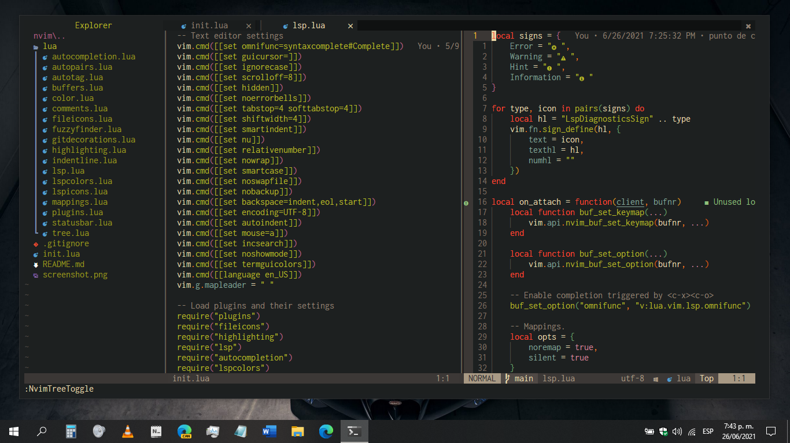
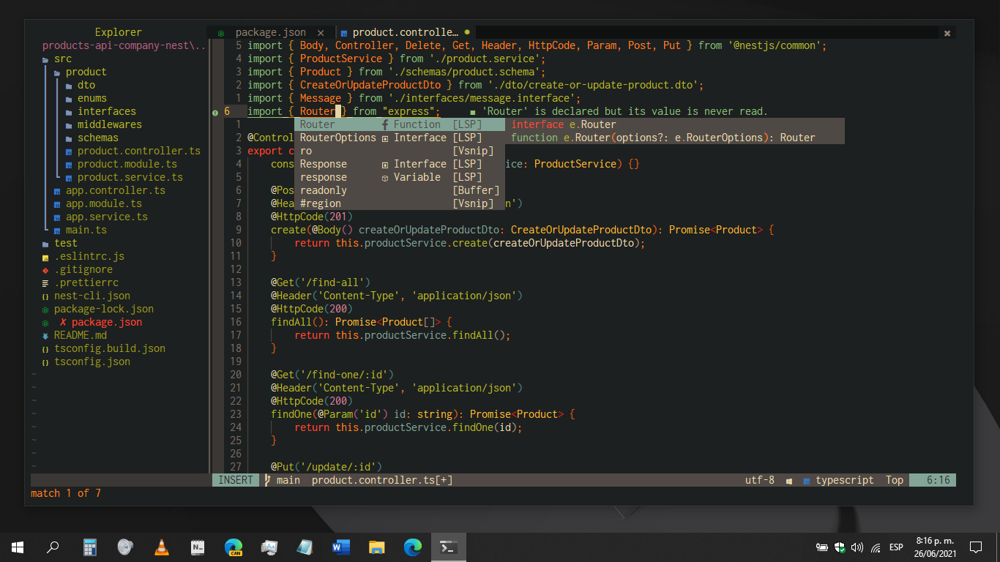

# My Neovim config for Windows

Screenshot 1


Screenshot 2


Screenshot 3


Screenshot 4


## Installation

1. Clone `packer.nvim` in `%USERPROFILE%\AppData\Local\nvim-data\site\pack\packer\start\packer.nvim`
```shell
git clone https://github.com/wbthomason/packer.nvim/ %USERPROFILE%\AppData\Local\nvim-data\site\pack\packer\start\packer.nvim
```

2. Clone `dotfiles-neovim-windows` in `%USERPROFILE%\AppData\Local\nvim`
```shell
git clone https://github.com/gmr458/dotfiles-neovim-windows %USERPROFILE%\AppData\Local\nvim
```

3. Open Neovim and execute `:PackerInstall`
