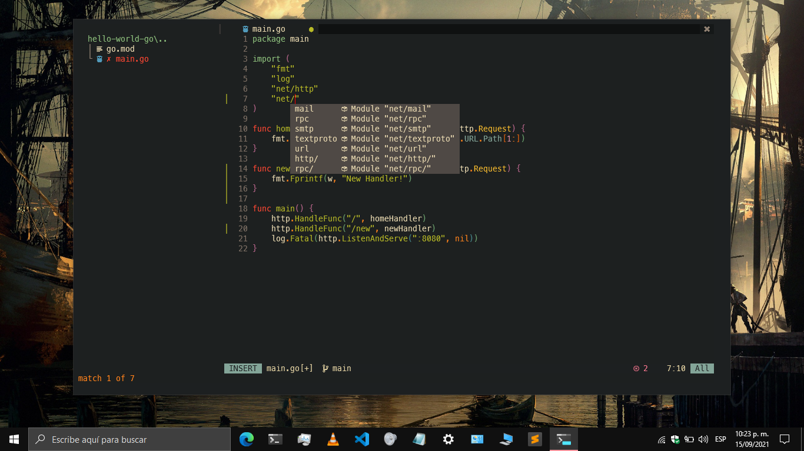
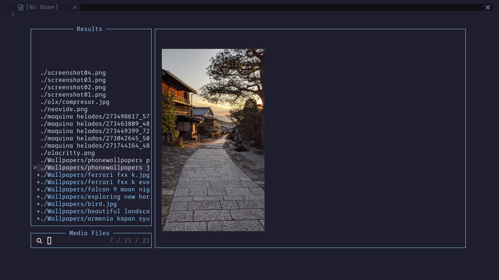

# My Neovim config for Windows

Screenshot 1


Screenshot 2


Screenshot 3


Screenshot 4


Screenshot 5


Screenshot 6


Screenshot 7


Screenshot 8


Screenshot 9


## Installation

1. Run this command in Windows Powershell to install the plugin manager [packer.nvim](https://github.com/wbthomason/packer.nvim):
```shell
git clone https://github.com/wbthomason/packer.nvim "$env:LOCALAPPDATA\nvim-data\site\pack\packer\start\packer.nvim"
```

2. Clone `dotfiles-neovim-windows` in `%USERPROFILE%\AppData\Local\nvim`:
```shell
git clone https://github.com/gmr458/dotfiles-neovim-windows %USERPROFILE%\AppData\Local\nvim
```

3. Open Neovim and execute `:PackerInstall`

4. Install the language servers for Python, CSS, HTML and JavaScript/TypeScript with `npm`:
- [pyright](https://github.com/microsoft/pyright) for Python
- [vscode-langservers-extracted](https://github.com/hrsh7th/vscode-langservers-extracted) for HTML, CSS and JSON
- [typescript-language-server](https://github.com/typescript-language-server/typescript-language-server) for JavaScript/TypeScript
```
npm install --global pyright vscode-langservers-extracted typescript typescript-language-server
```

5. Install the language server [gopls](https://github.com/golang/tools/tree/master/gopls) for Go. Golang should be installed.
```
go get golang.org/x/tools/gopls@latest
```

6. Install the language server [rust-analyzer](https://github.com/rust-analyzer/rust-analyzer) for Rust, `rustup`, `cargo` and `rustc` should be installed:
```
git clone https://github.com/rust-analyzer/rust-analyzer.git
```
```
cd rust-analyzer
```
```
cargo xtask install --server
```

7. LSP for C/C++ requires `clangd` to be installed, [Instructions to install here](https://clangd.llvm.org/installation.html).
