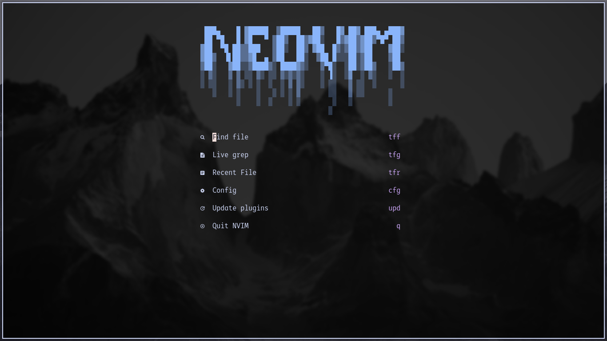
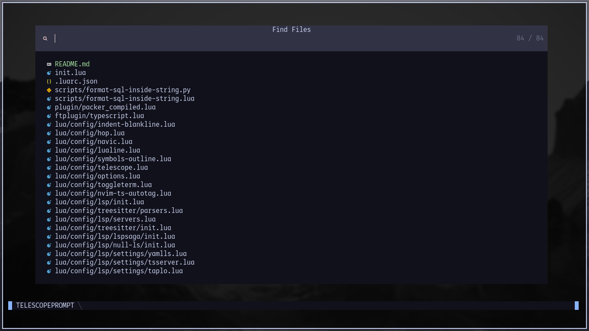
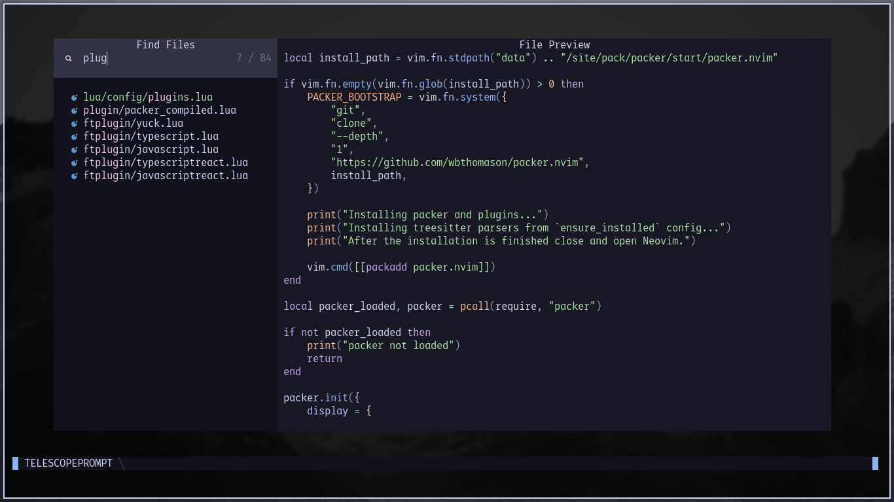
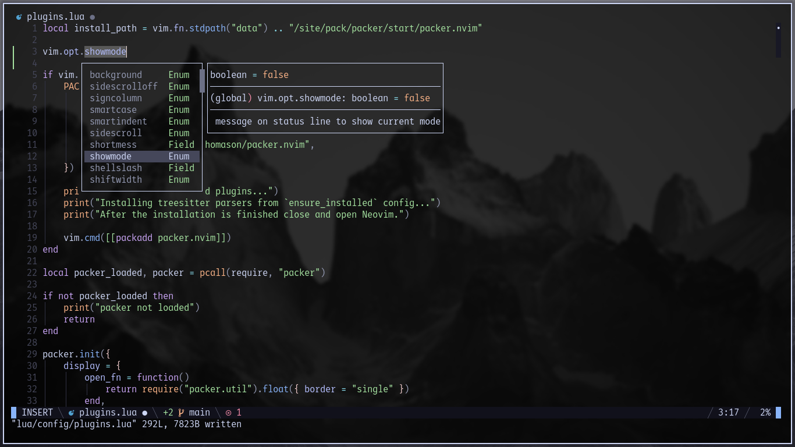

# Neovim config






## Requirements

1. Neovim >= v0.8.1
2. Git
3. [nvim-treesitter requirements](https://github.com/nvim-treesitter/nvim-treesitter#requirements)
3. [mason.nvim requirements](https://github.com/williamboman/mason.nvim#requirements)

## Installation

1. Clone the repository.

> Powershell

```shell
git clone https://github.com/gmr458/nvim.git "$Env:LOCALAPPDATA\nvim"
```

> CMD

```shell
git clone https://github.com/gmr458/nvim.git %USERPROFILE%\AppData\Local\nvim
```

> Linux

```shell
git clone https://github.com/gmr458/nvim.git ~/.config/nvim
```

2. Open Neovim, plugins and treesitter parsers in `ensure_installed` property from treesitter config will be installed automatically. Close after the installation of plugins and treesitter parsers is finished.

3. Open Neovim and use the command `MasonInstallListPackages` to install LSP servers, formatters and linters listed in `./lua/config/lsp/mason/list-packages.lua`.

4. Use the command `LspStart` to start `nvim-lspconfig`, `nvim-navic`, `mason.nvim`, `null-ls.nvim` and `lspsaga.nvim`. Now you can get LSP completions, LSP diagnostics, formatting, linting and other utilities that `nvim-navic` and `lspsaga.nvim` provide.

This config is highly influenced by [LunarVim/Neovim-from-scratch](https://github.com/LunarVim/Neovim-from-scratch)
